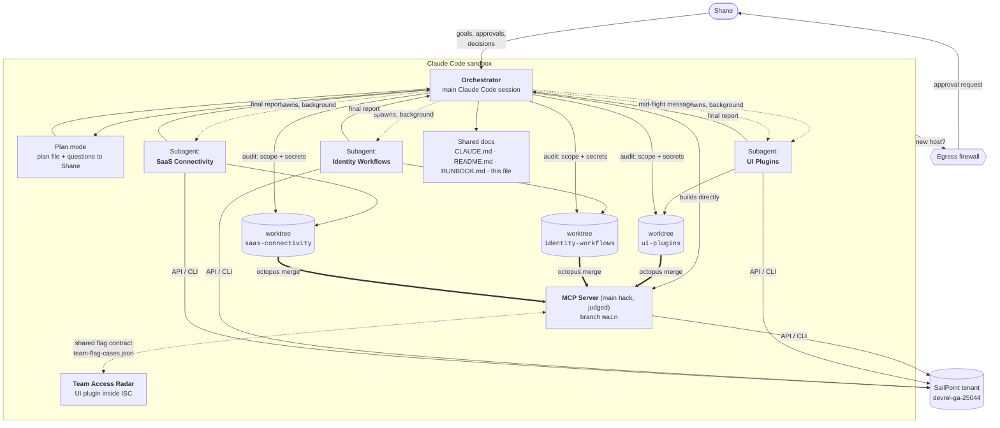

# How we used agents to build this

*Living document. Last updated 2026-10-05. Update it whenever an agent is started, finishes, or changes how we coordinate.*

One **Claude Code session** acted as the **orchestrator**. It planned the work, built the judged main hack
(MCP Server) itself, and handed each other Hack Day track to a **background subagent**. Each subagent got
its own **git worktree and branch**, so all of them could work at the same time without touching each other's
files. A human (Shane) stayed in the loop for anything that left the sandbox or changed the shared tenant.

## The big picture



## Who did what

| Agent | Kind | Worked in | Delivered | Effort |
|---|---|---|---|---|
| **Orchestrator** | Main Claude Code session | `python-mcp-server-template/` (`main`) | Plan; 4 MCP tools with shared flag logic, including `notify_manager` → workflow; 45 tests; proxy fix for the SDK; demo campaign; cross-platform launcher; VS Code setup; all shared docs; audits of every branch | the whole session |
| **UI Plugins** | Background `general-purpose` subagent | `ui-plugins/` → `ui-plugins/ui-plugins/` | Angular plugin "Manager Reports Search", 40 tests, `sail` CLI set up, plugin registered and linked in the tenant, judging rubric found, "Team Access Radar" idea | 66 tool calls · about 9 min |
| **Identity Workflows** | Background `general-purpose` subagent | `identity-workflows/` → `identity-workflows/identity-workflows/` | Onboarding workflow created and test-run green, plus a missing-manager variant; a "flagged report → email the manager" workflow the MCP server could trigger; 3 guide errors found | 55 tool calls · about 11 min |
| **SaaS Connectivity** | Background `general-purpose` subagent | `saas-connectivity/` → `saas-connectivity/saas-connectivity/` | TypeScript connector, 13 tests, deployed with `sail conn`, source aggregated (50 accounts, 8 entitlements), guide bug fixed | 82 tool calls · about 12 min |

## Timeline

```mermaid
sequenceDiagram
    autonumber
    actor U as Shane
    participant O as Orchestrator
    participant UI as UI Plugins agent
    participant IW as Identity Workflows agent
    participant SC as SaaS Connectivity agent

    U->>O: Set up the MCP Server hack
    O->>U: Firewall approval needed (developer.sailpoint.com)
    O->>O: Download template, uv venv, 13 tests pass
    U->>O: Make a plan (plan mode)
    O->>U: Which use case? Which client?
    U-->>O: Manager team access review · Inspector + Claude Code
    O->>O: Write plan, U approves, build 3 tools + tests
    U->>O: Also set up UI Plugins on its own branch
    O->>UI: spawn (worktree ui-plugins)
    U->>O: Also review Identity Workflows + SaaS Connectivity
    O->>IW: spawn (worktree identity-workflows)
    O->>SC: spawn (worktree saas-connectivity)
    O->>UI: course-correct: use localhost, add a README.md
    O->>U: Approve the tenant hosts
    U-->>O: approved
    O->>O: Live test, tune flags on real data, proxy fix
    UI-->>O: done (registered + linked in tenant)
    O->>U: Inspector override? Demo campaign?
    U-->>O: VS Code native; yes, create the campaign
    IW-->>O: done (workflow green)
    SC-->>O: done (source aggregated)
    O->>O: Audit branches, campaign ACTIVE, VS Code + runbook
    U->>O: Set the workflow recipient
    O->>U: Test email sent
    U-->>O: Email received
    U->>O: Merge to main, add Run and Debug
    O->>O: Octopus merge (no conflicts), debugpy + launch.json
    U->>O: Remove the old worktrees; link the workflow to the MCP tools
    O->>O: Keep config files, remove worktrees, deploy the workflow, add notify_manager
    O->>O: Live run fails, read the execution history, fix and retry
    O->>U: Manager email delivered for Brandon.Mason
    U->>O: Build the in-product version
    O->>O: Shared flag contract (Python reference), TypeScript port, Radar page
    O->>O: Live check: identical flags in Python and TypeScript for 3 teams
    U->>O: Upload it, add an Email manager button
    O->>O: Upload, add a Radar workflow copy, verify a test-endpoint run
    U->>O: Prefix our tenant resources with UCSF
    O->>O: Rename workflows, source, connector and plugin; replace the campaign
```

## How we kept parallel agents from colliding
1. **One worktree and branch per agent**, all created from `main`. No agent shares a working directory with another.
2. **Each track writes only inside a folder named after the track.** Branches touch disjoint paths, so merging them into `main` later can't conflict. The orchestrator checks this with `git diff --name-only main...<branch>`.
3. **The shared rules live in `CLAUDE.md`**: layout, tenant, credential handling, sandbox quirks. Any session in any worktree loads it automatically.
4. **Self-contained briefs.** Each subagent got the context it needed up front: where to work, what not to touch, known sandbox problems, safety limits for the shared tenant, the deliverables (`README.md` and `NOTES.md`), and a short report format.
5. **Mid-flight correction.** When the UI agent hit the firewall trying to reach its own sandbox IP, the orchestrator sent it a message: use `localhost`, and also write a human-readable README.
6. **The orchestrator verifies; it doesn't just trust.** Every branch was checked for changes outside its folder and for the PAT secret and demo API key anywhere in its history. All came back clean.

## Where the human stayed in the loop
| Gate | Why it's human |
|---|---|
| Firewall approvals (developer.sailpoint.com, tenant hosts, the demo app) | Each new outbound host is a policy decision |
| Use case and client choice | It's a product decision |
| Creating the demo certification campaign | It changes a shared tenant |
| Inspector safety override, which we replaced with running it natively on the Mac | It's a security trade-off |
| Merging branches, pushing | Nothing leaves the machine without a yes |

## Lessons learned
- **Shared tool state collides.** The agents shared `~/.sailpoint/config.yaml` and the orchestrator's scratch folder. The SaaS agent switched to its own CLI config folder. Next time, give each agent its own config folder up front.
- **Debug flags persist.** One `sail --debug` run saved debug mode to the config, and the next command printed a short-lived token into the session. `CLAUDE.md` now says *never use `--debug`*.
- **The guides have bugs.** The agents found and documented them: a schema-breaking `key` field (SaaS), wrong attribute mappings and contradictory instructions (Workflows). These are worth reporting to SailPoint DevRel.
- **Read the execution history; don't trust "accepted".** The first `notify_manager` run returned an execution ID, but the workflow had failed. The external trigger wraps the payload in `input`. A later 401 showed that saving the workflow had revoked its OAuth client. The tool now waits for the run to finish and reports the real result.
- **Shared mounts have sharp edges.** In-place `sed -i` edits in the sandbox left files owner-only, so VS Code on the Mac couldn't read `tasks.json`, and the launcher lost its execute bit. The user spotted it ("task not showing"). We fixed the permissions, now start the server via `/bin/sh`, and `CLAUDE.md` bans `sed -i`.
- **Put a contract between two implementations of the same rules.** Porting the flags to TypeScript was only safe with a shared case file that both test suites run. Writing it also exposed a hidden Python bug: the order of the shared-access list changed from run to run.
- **Test against real data early.** Live data showed the tenant has no roles, so the `no_roles` flag fired for everyone. It showed the SDK's `to_dict()` drops read-only fields, which emptied the certification output. And it gave us `missing_baseline`, a flag we hadn't planned.

## Changelog
| # | What (2026-10-05) |
|---|---|
| 1 | Orchestrator starts; template set up; plan approved |
| 2 | UI Plugins subagent started on its worktree |
| 3 | Identity Workflows and SaaS Connectivity subagents started; shared CLAUDE.md and README written |
| 4 | Tenant reachable; MCP tools tested live and tuned; UI Plugins agent done |
| 5 | Identity Workflows and SaaS Connectivity agents done; all branches audited |
| 6 | Demo campaign ACTIVE; VS Code native MCP + tasks; RUNBOOK.md; this document |
| 7 | Identity Workflows recipient set to Shane's demo inbox; tenant workflows updated and test-run by the orchestrator; Shane confirmed the email arrived with every field filled in |
| 8 | All three track branches merged into `main` in one octopus merge (`12e3ad1`) with no conflicts, thanks to one folder per track; worktrees retired |
| 9 | VS Code Run and Debug: `launch.json`, a `sailpoint-debug` MCP server with debugpy on :5678, and `scripts/call_tool.py` |
| 10 | Worktrees removed (gitignored config copied to `main` first) |
| 11 | MCP ↔ Workflows link: `notify_manager` triggers the deployed *Flagged Report to Manager* workflow with the workflow's own OAuth client; the manager email for Brandon.Mason was delivered |
| 12 | Fixed file permissions broken by in-place edits (tasks missing in VS Code); configs now start the launcher via `/bin/sh` |
| 13 | At Shane's request, everything (setup, tests, demo steps, tools, other tracks) now runs from the VS Code ▶ Run and Debug dropdown; tasks.json removed; Identity Workflows got its own entries; every README now leads with the ▶ list; every safe entry dry-run in the sandbox |
| 14 | Team Access Radar: the UI plugin becomes the in-product team review. TypeScript port held to `shared/team-flag-cases.json`, 51 plugin tests, identical to Python on live data, manifest renamed in the tenant |
| 15 | Team Access Radar uploaded to the tenant; **Email manager** button (through a disabled workflow copy started by the test endpoint, since browsers can't hold the trigger secret) |
| 16 | At Shane's request, everything we created in the shared tenant renamed with a **UCSF** prefix: workflows, campaign (replaced, since active campaigns can't be renamed), source, connector, plugin |
