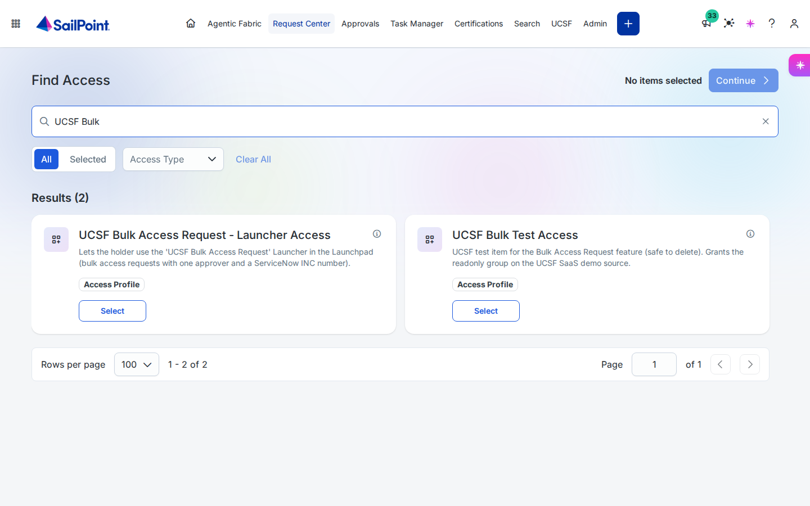
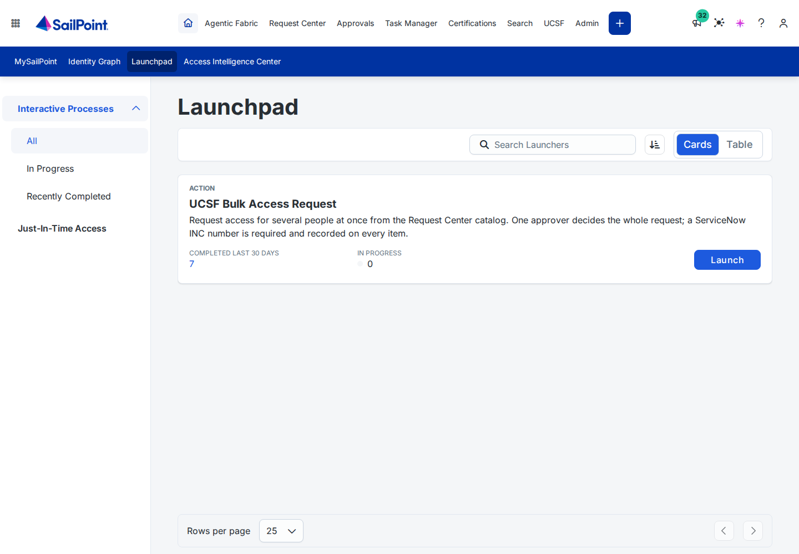
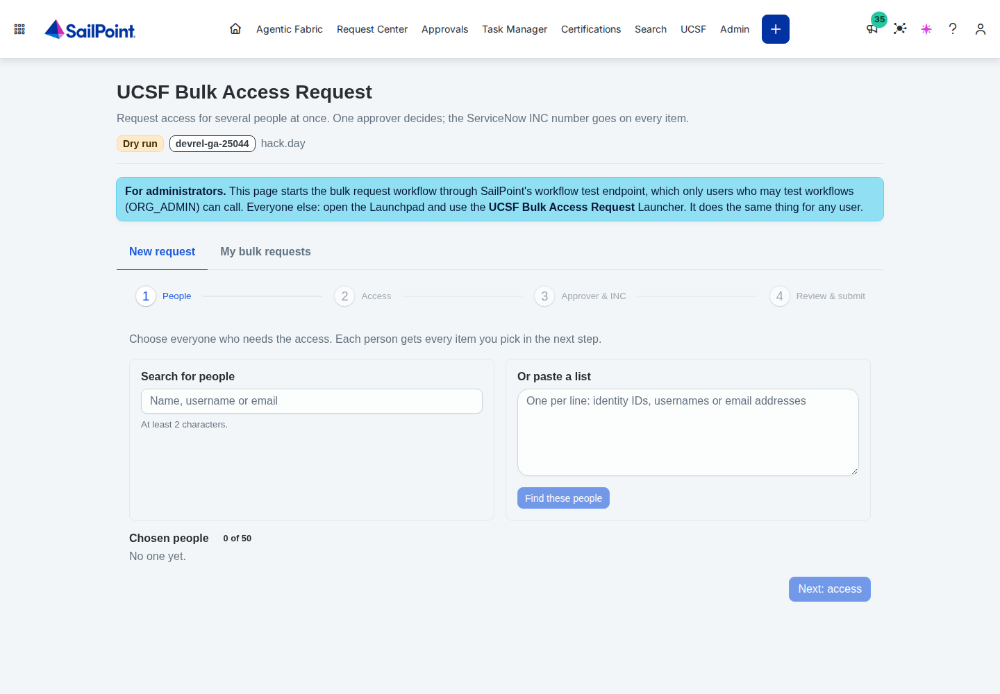
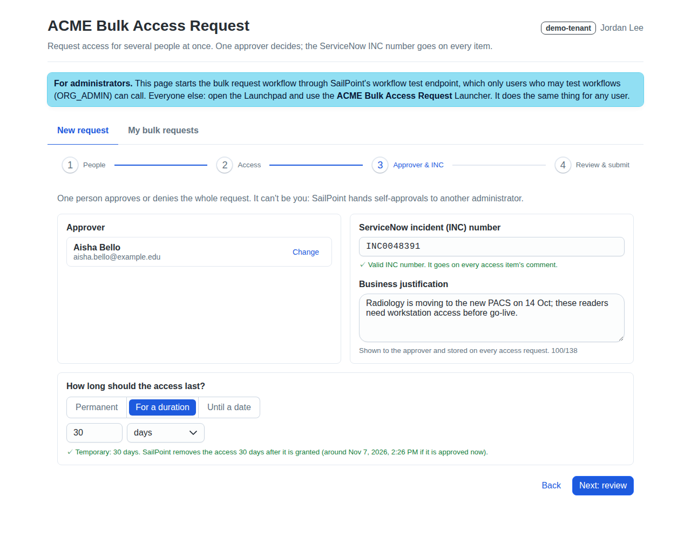
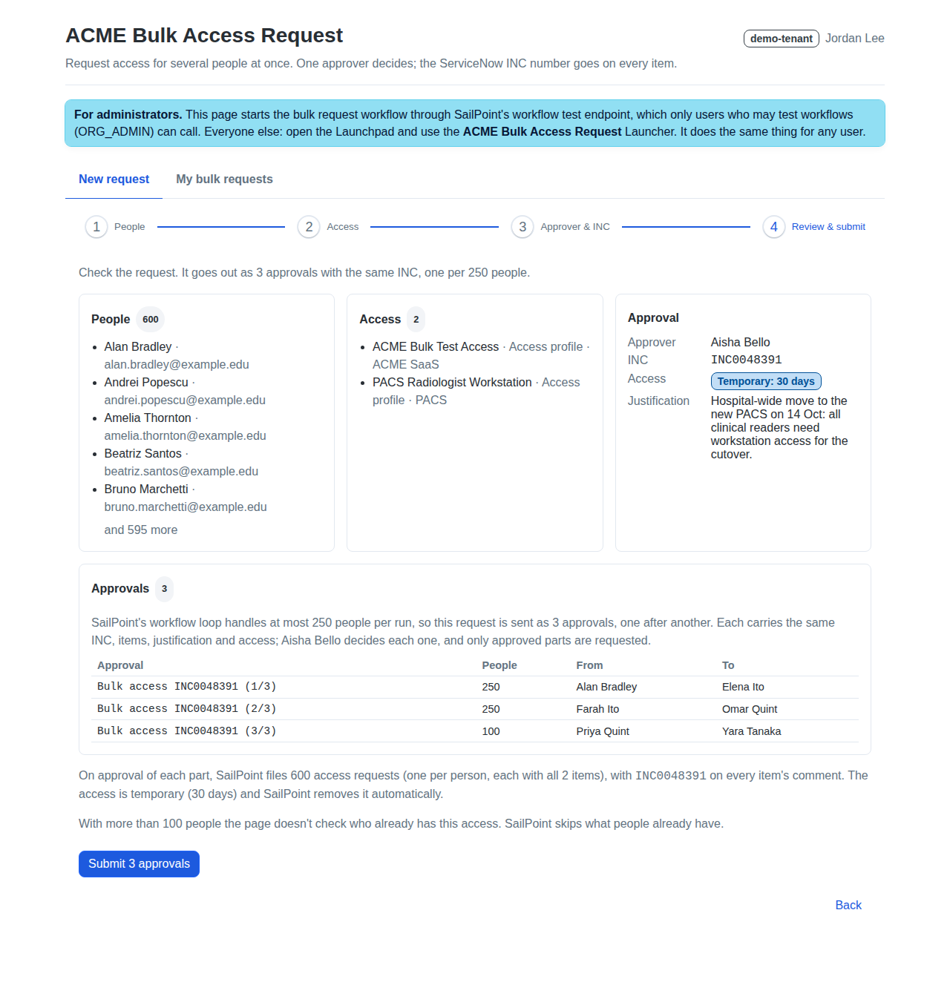
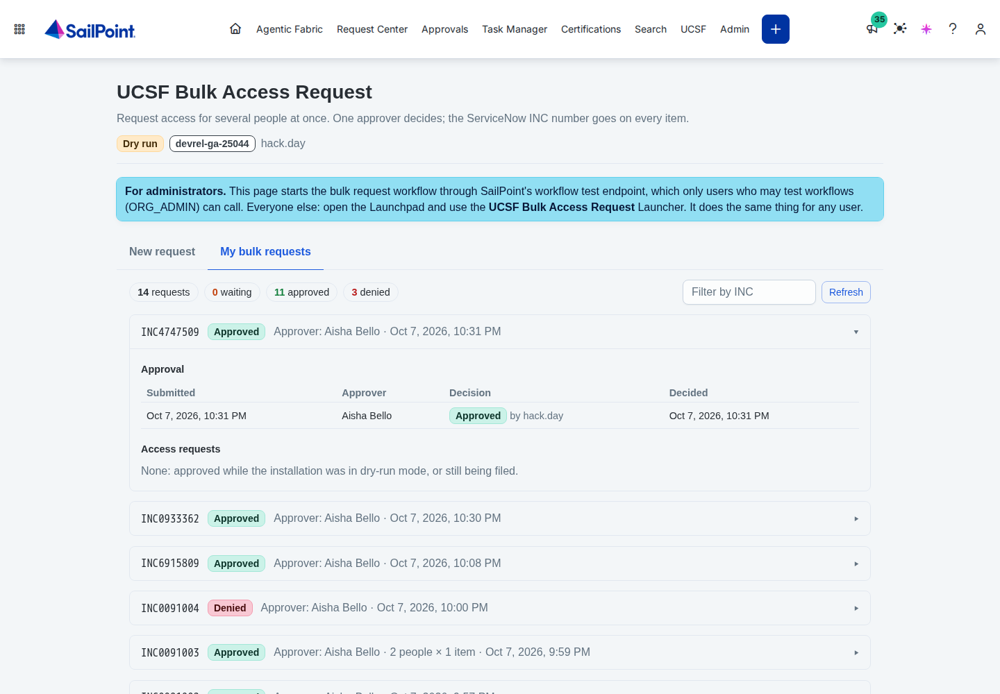

# Using Bulk Access Request

Guides for requesters, approvers and admins. Screenshots live in [docs/screenshots/](docs/screenshots/).

## Requesters, with the Launcher (any user)
1. **Get access to the tool, once.** In the **Request Center**, request **"<prefix> Bulk Access Request - Launcher
   Access"**. Your manager may need to approve it. After about a minute it shows up in your **Launchpad**.

   
2. **Launchpad → "<prefix> Bulk Access Request"** → **Launch**. A form opens:

   

   | Field | What to enter |
   |---|---|
   | **People who need the access** | Add up to 30 people. **Type the full username** (e.g. `Adam.Kennedy`): the picker only matches complete usernames. You can also scroll the list. |
   | **Access to request** | One or more items. *Everyone* above gets *every* item chosen here. |
   | **Access type** | **Permanent** (the default) or **Temporary**. Only shown if your admin turned temporary access on. |
   | **Duration** and **unit** | For temporary access: a whole number of 1 or more, and hours, days, weeks or months (your admin may offer fewer units). |
   | **Approver** | The one person who decides. It can't be you. |
   | **ServiceNow incident (INC) number** | For example `INC0012345`. The form won't submit until the format is right. |
   | **Business justification** | Shown to the approver and stored on every request |

   

   A badly formatted INC is caught before anything is sent:

   
3. **Submit.** The Launchpad shows *"Sent to <approver> for approval."* If the duration isn't valid (not a whole
   number, or longer than your admin allows), the Launchpad says so and no approval is sent.
4. **You get an email** when it's decided. If approved, each person's request appears in
   **Request Center → Track My Requests** with your INC in the comment. Temporary access shows its remove date there.

## Requesters, with the UI plugin (admins)
Open **<prefix> Bulk Access Request** from the nav bar, or the plugin link your admin gave you, and follow the four
steps: people → items → approver and INC → review. Details are in [plugin/README.md](plugin/README.md).

- **People.** Search, or paste a list of usernames, emails or identity IDs. There's no upper limit unless your admin set one.
- **How long.** Choose **Permanent**, a **duration** (a whole number and a unit: hours, days, weeks or months), or an
  **end date** after today. With an end date, the access lasts until the end of that day, in your local time. Your admin
  may turn some of these off, or cap how long temporary access can last.

  
- **Big lists are sent in parts.** One approval can cover at most 250 people (your admin may set fewer). Above that,
  the review step shows how the list will be split, and submitting sends one approval per part. Every part has the same
  INC, items, approver, justification and access type. The approver sees one task per part, named
  `Bulk access INC0012345 (2/3)`.

  
- **My bulk requests** shows everything you've submitted, grouped by INC.

  

**When temporary access starts counting.** A duration counts from when the access is requested, which happens after
the approval. The plugin turns an end date into a number of hours when you submit, so a slow approval moves the end
later by about the same time.

## Approvers
- You get **one** approval task per bulk request, named **"Bulk access INC…"**, showing the requester, the
  justification and the access type. It arrives in your **SailPoint approvals** (and by email, if notifications are on).
- **The access type** is in the task's description: `Permanent`, `Temporary: 30 days` or `Temporary: until 2026-11-07`
  (the Launcher may write durations short, for example `Temporary: 30d`).
- **Parts.** A large plugin request arrives as several tasks with the same INC, named for example
  `Bulk access INC0012345 (1/3)`, `(2/3)` and `(3/3)`. Each covers different people and is decided on its own: approving
  one part doesn't approve the others.
- **Approve:** everyone on the request (or part) gets every item, as normal access requests.
- **Deny:** nothing is requested for those people, and the requester is told.
- The task expires after the configured number of days (7 by default).

## Admins
- **Install, update, uninstall:** see [INSTALL.md](INSTALL.md). Everything is set in one file, `config/<tenant>.json`.
  - Check health: `python bulkaccess.py status --config …`.
  - After any config change, or when the catalog changes: `python bulkaccess.py apply --config …`.
- **Who can use it:** whoever holds the *Launcher Access* profile. It's an ordinary access profile, so it shows up in
  certifications too. The plugin needs ORG_ADMIN-level users.
- **Temporary access** (`temporaryAccess` in the config): turn it on or off, choose the units, allow end dates (plugin
  only), and cap the length with `maxDays`. It ends automatically on the remove date, and SailPoint removes it with no
  further action. The remove date is visible in **Track My Requests**.
- **Audit:**
  - Every request made by the tool has this comment:
    `INC… | Bulk access request by <requester> | Approved by <approver> | <access> | <justification>`,
    where `<access>` is `Permanent` or `Temporary: …`. The INC always comes first.
  - The approval decisions are in the generic approvals history. Parts share the INC, so search for it to find them all.
  - Each run is in **Admin → Workflows → "<prefix> Bulk Access Request" → Execution History** (the plugin's runs are
    under "<prefix> Bulk Access Request (Plugin)").
- **Test safely:**
  - Keep `"mode": "dry-run"` until you've run `launcher/e2e.py` on test identities.
  - In shared or test tenants, set `notifications.overrideRecipients` so emails don't reach real people.
