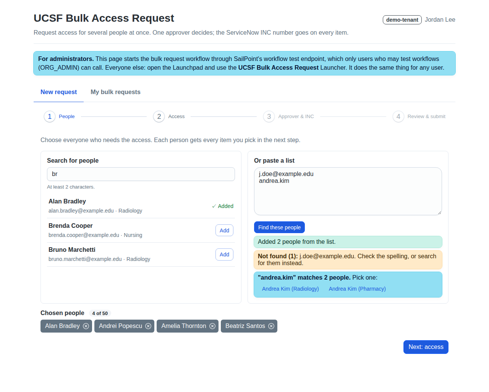
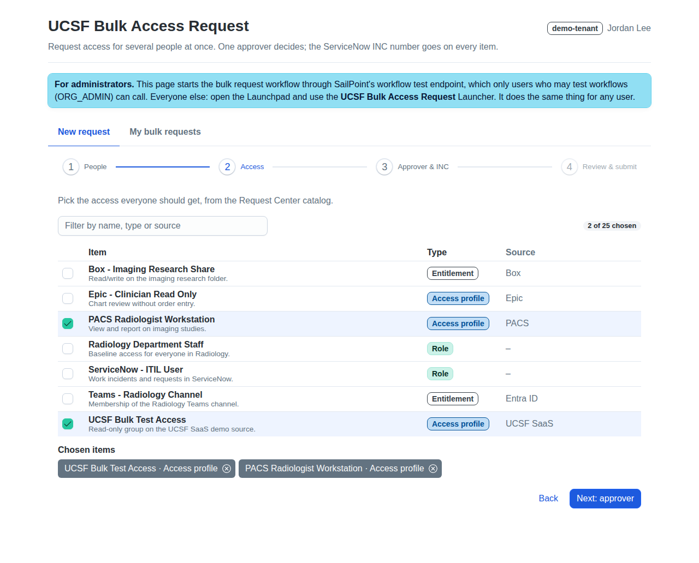
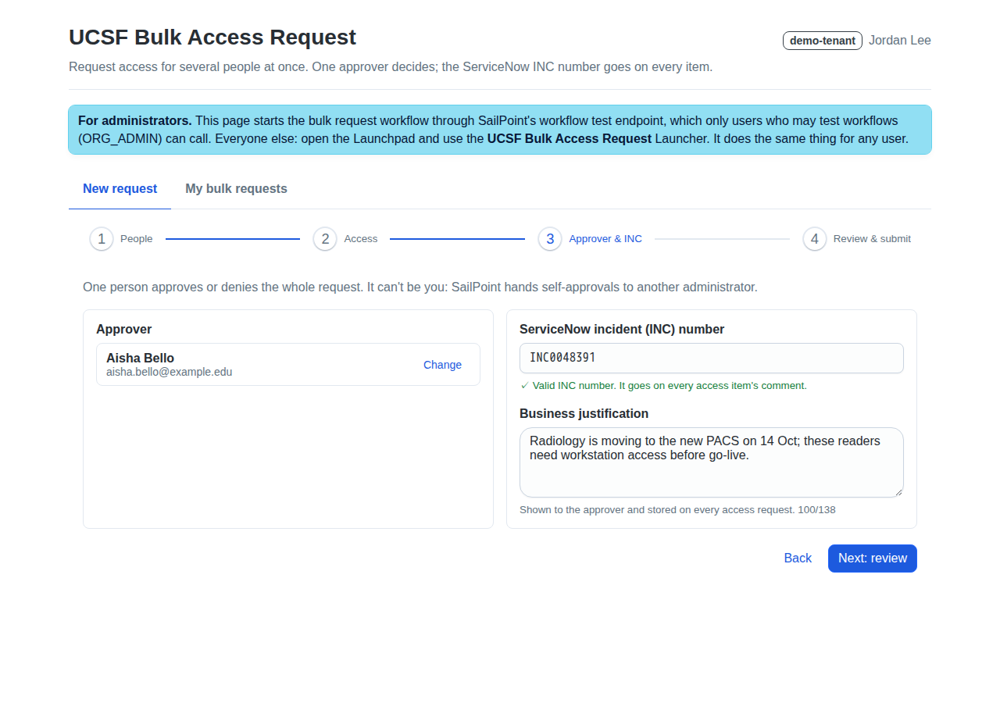
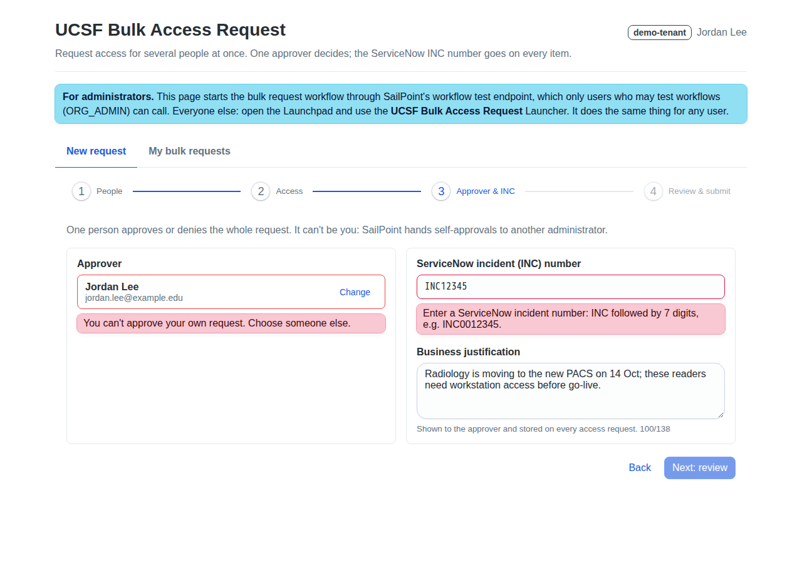
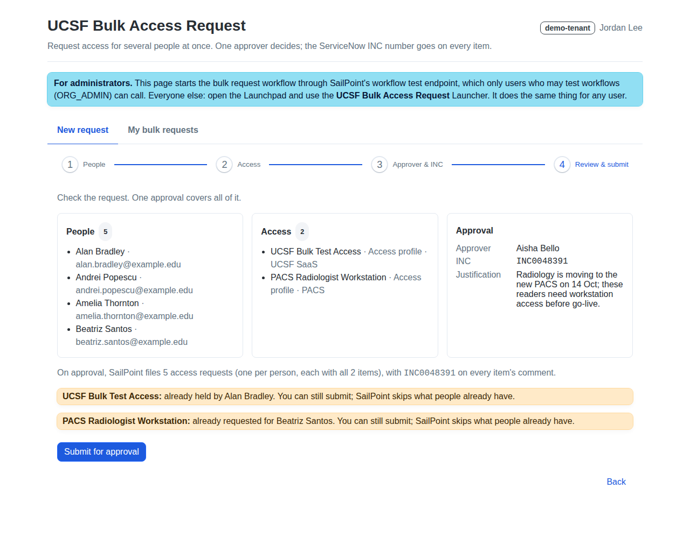
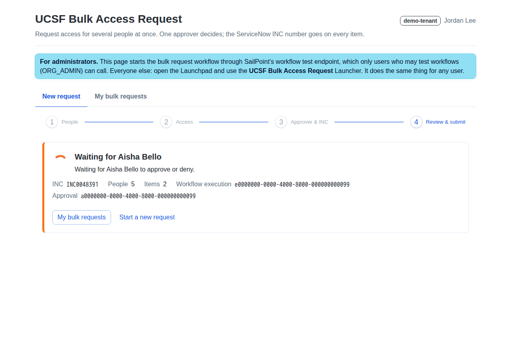
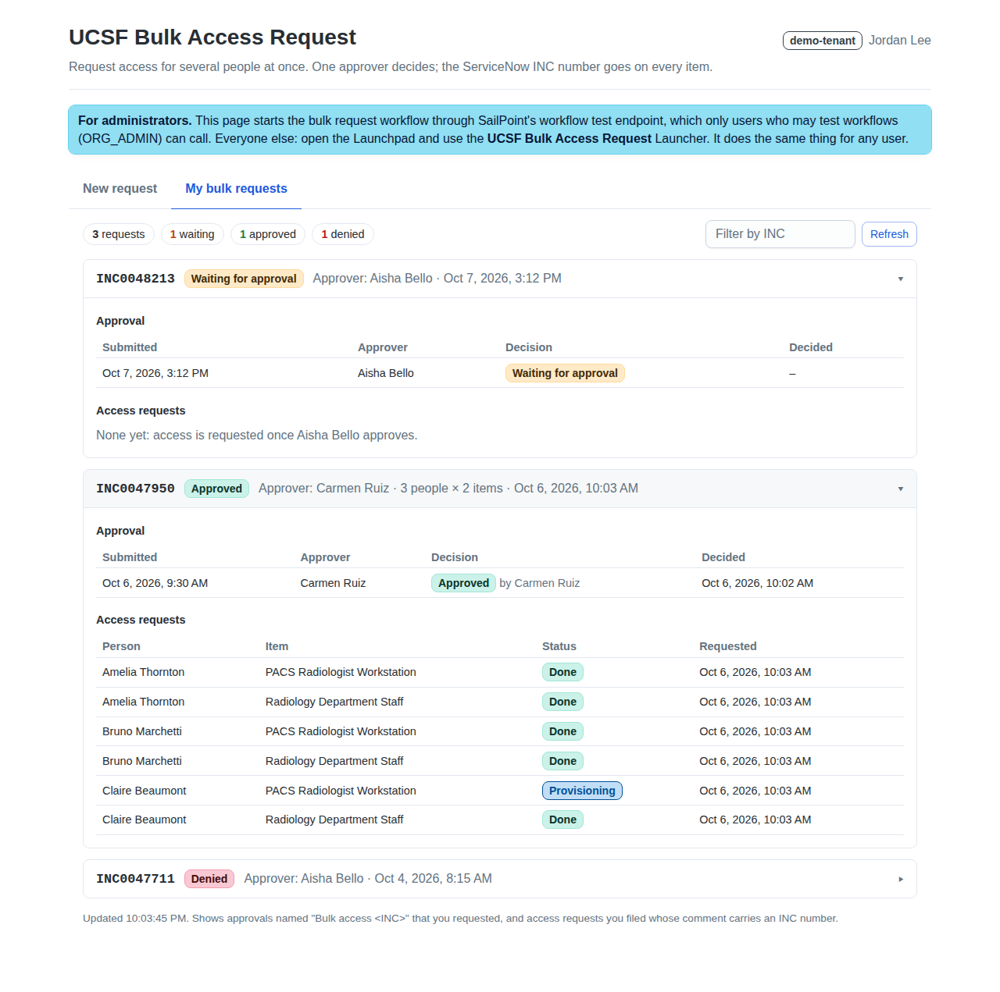

# Bulk Access Request: UI plugin (deployment B)

This is a page inside SailPoint Identity Security Cloud (ISC) for requesting access for many people at once:

1. **People.** Search for people, or paste a list of identity IDs, usernames or email addresses.
2. **Access.** Pick one or more items from the Request Center catalog.
3. **Approver and INC.** Choose one approver for the whole request (it can't be you), enter the ServiceNow
   incident number (INC) and a justification.
4. **Review and submit.** The page then follows the approval and shows "Waiting for *approver*", followed by the outcome.

The approver makes one decision for the whole request. When they approve, SailPoint files one access request per person, each
with all the chosen items, and puts the INC number in every item's comment. A second tab, **My bulk requests**,
lists your bulk requests grouped by INC.

The same code installs into any tenant. Everything tenant-specific (names, INC rule, limits, catalog filter) comes
from a config file, and nothing is hard-coded.

| | |
|---|---|
|  |  |
|  |  |
|  |  |
|  | *(Screenshots use made-up demo data.)* |

## Who can use it: ORG_ADMIN only

**Only users who can test workflows (in practice, ORG_ADMIN) can submit from this page.** The reason is how the page
starts the workflow:

- A browser plugin can't safely hold the OAuth client secret that a workflow's external trigger needs.
- So the page starts the workflow through SailPoint's **workflow test endpoint** (`POST /v3/workflows/{id}/test`), using
  the signed-in user's own session. Only users with the right to test workflows can call that endpoint.
- The test endpoint only runs **disabled** workflows. The installer creates the plugin's workflow disabled, so leave it
  that way.

The page shows a banner that explains this. For people who aren't ORG_ADMIN, it also says so and turns the Submit button off.

**Everyone else uses the Launcher.** The Launcher deployment (`../launcher/`) does the same job for any user,
from the Launchpad, with SailPoint's own form.

**Production alternative.** To let non-admins use this richer page, put a small backend between the page and
SailPoint. The backend holds the workflow's external-trigger OAuth client, checks the caller, and calls the external
trigger URL. The page would then call that backend (add its origin to the manifest's `contentSecurityPolicies`) instead
of the test endpoint, and the workflow can be enabled. That backend is not part of this repository.

## What gets installed

All names come from `prefix` in the config (here `ACME`), so several copies can live in one tenant and you can always
tell them apart:

| Object | Name | Notes |
|---|---|---|
| Workflow | `<prefix> Bulk Access Request (Plugin)` | **Disabled**, external trigger, owned by the installer's identity (or `owner`). |
| UI plugin | alias `plugin.alias` (default `<prefix>-bulk-access`), name `plugin.displayName` | Created **private** (only you can see it) unless you pass `--public`. |

The workflow: looks up the requester and approver → refuses self-approval and a bad INC (as a second check after the page) →
**one generic approval** named `Bulk access <INC>`, assigned to the approver → if approved and `mode` is `live`,
**Manage Access once per person** with all items and the comment `<INC> | Bulk access request by … | Approved by … | <justification>` →
an email to the requester (or to `notifications.overrideRecipients`).

In `dry-run` mode everything runs, including the approval and the emails, except the access requests themselves. Start in dry-run.

## Requirements

- An ISC tenant with **UI Plugins** turned on, and a **personal access token** of an ORG_ADMIN, who becomes the owner of what's installed.
- Python 3.10+ (no extra packages), Node.js 22+ with **npm 11.12+** (`npx -y npm@11 …`), and the
  [SailPoint CLI](https://github.com/sailpoint-oss/sailpoint-cli) `sail` 2.7+.

## Configure

1. Copy `config/bulk-access.example.json` to `config/<tenant>.json` (files in `config/` are gitignored). The settings the plugin uses:

   | Setting | Meaning |
   |---|---|
   | `envFile` | A `.env` file with `SAIL_BASE_URL` (e.g. `https://acme.api.identitynow.com`), `SAIL_CLIENT_ID`, `SAIL_CLIENT_SECRET`. The secret never goes in the config. |
   | `prefix` | Names every object (see above). |
   | `mode` | `dry-run` (approve, but request nothing) or `live`. |
   | `inc.pattern`, `inc.example`, `inc.message` | The INC rule, e.g. `^INC\d{7}$`. Write a pattern that means the same in Python and JavaScript (plain classes such as `\d` and `[A-Z]`, anchors, groups). |
   | `catalog.types`, `catalog.nameStartsWith`, `catalog.maxItems` | Which Request Center items the page offers (max 25 per request). |
   | `people.max` | How many people one request may cover (max 250). |
   | `approval.*` | Timeout days, what happens at timeout, priority. |
   | `notifications.overrideRecipients` | For test tenants: send every email here instead of to real people. |
   | `plugin.alias`, `plugin.displayName` | The plugin's alias (lowercase, digits, dashes) and the name shown in ISC. |

2. The installer turns this into two files the page reads. Don't edit them by hand:
   - `public/bulk-access.config.json`: the runtime config (workflow name and ID, INC rule, limits, catalog filter). The committed copy holds neutral defaults.
   - `sp-ui-plugin.json`: the plugin manifest (alias, name, `apiScopes: ["sp:scopes:all"]`, slot `full-page`).

## Install

Run these from `bulk-access-request/`:

```bash
# 0. Once: install the page's dependencies (needs npm 11.12+)
(cd plugin && npx -y npm@11 install)

# 1. See exactly what would be sent. This changes nothing.
python plugin/install.py --config config/<tenant>.json --dry-run

# 2. Create or update the workflow, write the runtime config and manifest,
#    build the page and upload it (first time: `sail ui-plugins create --private`)
python plugin/install.py --config config/<tenant>.json --deploy

# 3. Check
python plugin/status.py --config config/<tenant>.json --plugin
```

`install.py` is idempotent: it finds the workflow and the plugin by name and alias, and updates them. Re-run it after any config change.
Options:
- `--deploy` also runs `npm run build`, then `sail ui-plugins create` (first time) or `push-manifest` (after that), then
  `sail ui-plugins upload`. The plugin stays **private to you** unless you pass `--public`. Pass the same choice every time:
  `push-manifest` replaces the whole manifest, visibility included.
- `--workdir <folder>` builds a different copy of this folder (one with its own `node_modules`). The generated files are written there,
  not here. `sail ui-plugins create` also writes the tenant's CSP into that copy's `angular.json`.
- The CLI gets the PAT from `envFile` through environment variables. Set `SAIL=/path/to/sail` if `sail` isn't on your PATH.
  Never run `sail` with `--debug`: it saves that setting and prints access tokens.

Then open the plugin: `https://<tenant>.identitynow.com/ui/plugin/<plugin id>` (the installer prints it). To put it in the menu:
**Admin → Global → System Settings → Customize Navbar → Custom Item → Destination: Plugin.**

### Go live

When dry-run behaves, set `"mode": "live"` in the config and run `install.py` again. The page shows a **Dry run** tag in its header while the workflow is in dry-run mode.

## Use

- **New request.** Work through the four steps. Each step checks its input as you go:
  - the INC number is checked against the pattern while you type;
  - you can't choose yourself as approver;
  - the item and people limits come from the config;
  - the justification is kept short enough for SailPoint's 150-character approval comment.
  
  On the review step the page warns you if someone already has, or has already requested, an item. After you submit, it shows the
  workflow execution and approval IDs and keeps checking until the approver decides.
- **My bulk requests.** This tab shows your requests grouped by INC: the approval (who decides, the decision, when) and, once approved in live mode, every
  access request with its status. It joins two lists: approvals named `Bulk access <INC>` that you requested, and access requests you filed
  whose comment carries an INC number. Requests made through the Launcher show up here too.

The approver decides in ISC as usual (**Home → Approvals**), or an admin can decide for them through `POST /v2025/generic-approvals/{id}/approve` or `/reject`.

## Uninstall

```bash
python plugin/uninstall.py --config config/<tenant>.json --plugin   # asks before deleting; --yes to skip
```

This deletes only the workflow named exactly `<prefix> Bulk Access Request (Plugin)` and, with `--plugin`, the plugin whose alias and name match
the config. It refuses anything whose name doesn't start with the prefix. It doesn't touch access requests or approvals that already exist.

## Develop and test

```bash
cd plugin
npx ng test --watch=false        # unit tests (vitest): rules port, API calls, grouping, submission flow
npm start                        # https://localhost:4200, for `sail ui-plugins link` development inside ISC
npm run start:demo               # then open http://localhost:4300/?demo=review  (no tenant needed)
cd .. && python -m pytest plugin/tests -q    # installer tests (dry-run payloads, idempotency, safe uninstall)
```

**Demo mode.** `?demo=<scenario>` runs the page on its own with made-up data. The scenarios are `new`, `people`, `items`, `approver`,
`approver-error`, `review`, `submitted` and `history`. Demo mode is ignored inside ISC, where the page always runs in an iframe. The screenshots above
come from it.

**The rules match the core.** `src/app/bulk/rules.ts` is a port of `core/bulkaccess/rules.py` (request validation, INC check, approver ≠ requester,
catalog filter). `rules.spec.ts` mirrors `core/tests/test_core.py`. If you change a rule, change both.

## Troubleshooting

| Symptom | Cause and fix |
|---|---|
| "SailPoint refused the call (HTTP 403)" on submit | You aren't allowed to test workflows. Use the Launcher, or see *Production alternative*. |
| "The workflow … is not installed" | Run `install.py` against this tenant. The page finds the workflow by ID (from the runtime config) or by name. |
| Someone can't be found by search | New identities can take a while to reach the search index. The page also looks people up through their accounts. If that fails too, paste their identity ID. |
| An access request shows **Cancelled: "Already has a pending request for this item"** | That person already had an open request for the item. SailPoint skips duplicates. |
| The workflow run **Failed** and no approval appeared | The workflow's own checks stopped it: the INC was invalid or the approver was the requester. The requester gets an email. |
| `sail` prints "Secrets storage is not currently functional" | This is harmless. The scripts pass the PAT through environment variables. |

## Files

| Path | What it is |
|---|---|
| `install.py`, `status.py`, `uninstall.py`, `pluginlib.py` | The installer scripts. They use the shared core in `../core/bulkaccess/`. |
| `tests/` | pytest tests for the installer. |
| `sp-ui-plugin.json`, `public/bulk-access.config.json` | The manifest and runtime config, both generated by `install.py`. |
| `src/app/bulk/` | Rules port, runtime config, API calls, request state, the grouping logic for My bulk requests. |
| `src/app/features/` | The two tabs: `new-request/` (four steps) and `my-requests/`. |
| `src/app/core/` | SailPoint plugin SDK wrapper, from the official Angular starter. |
| `src/app/demo/` | Demo mode and its made-up fixtures, also used by the unit tests. |
